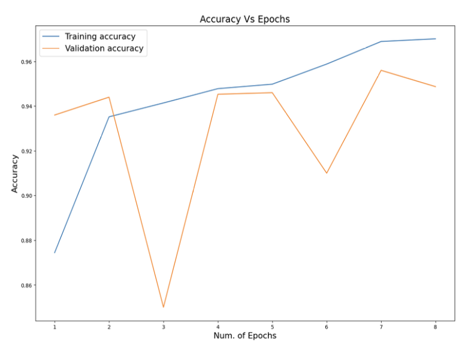
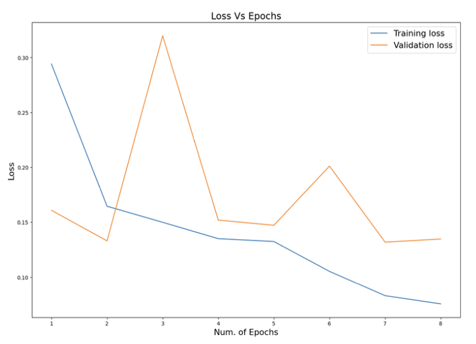

# Lung Cancer Detection Using Vision Transformer

## Background

- Lung cancer is a fatal disease, with 1 out of every 16 people suffering from it around the globe.

- It is the leading cause of cancer deaths in the United States.

- Manual diagnosis using CT scans and X-rays is time-consuming and error-prone. 

## Motivation
- Automated systems using Convolutional Neural Networks (CNNs) can enhance accuracy as they capture localized features well, but they miss to capture global relationships in images, which could further improve accuracy.

- For this project, we aim to use Vision Transformer (ViT) as an image classification technique for lung cancer detection as an alternative to Deep CNNs.

- **What is a Vision Transformer?**

  - Vision Transformer is a deep learning model that applies transformer architecture to computer vision tasks.

  - It works by splitting the image into smaller patches, linearly projecting them and adding embeddings, and then feeding them to a stack of transformer encoder layers.

## Goal 
- Our final goal is to explore the effectiveness of Vision Transformer (ViT) for lung cancer detection and compare its performance with pretrained CNNs in this area.

## About the Dataset
- For this study, we used a [Kaggle dataset](https://www.kaggle.com/datasets/andrewmvd/lung-and-colon-cancer-histopathological-images) consisting of 15,000 labeled lung histopathological images . 

- The dataset is categorized into the following 3 classes:

| S.No | Class Name                        | Dataset Class Label |
|------|-----------------------------------|---------------------|
| 1    | Lung benign tissue                | lung_n              |
| 2    | Lung adenocarcinoma               | lung_aca            |
| 3    | Lung squamous cell carcinoma      | lung_scc            |

## Training Process
- During the training process, we compiled both the pretrained ResNet50 and the ViT-based model using the Adam optimizer, categorical crossentropy as the loss function, and a batch size of 64.

- Both the models were trained and validated for 8 epochs and converged properly. 

- Performed:

  1. Model Architecture adjustments
  3. Hyperparameter tuning
  3. Fine-Tuning the models
  4. ViT model Performance Comparison with ResNet50

- The ViT-based model, with over 87M trainable parameters, took longer to train (around 5-6 hours) compared to the ResNet50 model, which had 36M parameters and took 3 hours using the T4 GPU provided by Google Colab.

## Results

1. Performance of Pretrained ResNet50 Model: 
  
  

  a) On Train and Validation Set:

    Training Accuracy Value = 74.30% 			
    Validation Accuracy Value = 75.27%
    Training Loss Value = 0.6099        			
    Validation Loss Value = 0.5693

  b) On Test Set:

    Testing Accuracy Value = 74%    			

  

2. Performance of Pretrained ViT Model: 
  
  

  a) On Train and Validation Set:

    Training Accuracy Value = 97.01% 			
    Validation Accuracy Value = 94.87%
    Training Loss Value = 0.0755      			
    Validation Loss Value = 0.1347

  b) On Test Set:

    Testing Accuracy Value = 96%      			

  

3. Accuracy vs Epochs and Loss vs Epochs Plots for the ViT Model:

<!--  -->

   
  

## Conclusion

-  We have conducted an analysis of our ViT-based sequential model, evaluated its performance, and observed that it outperforms the baseline pretrained ResNet50 model in accuracy for lung cancer detection.

- For future work, we plan to experiment with different optimizers, such as RectifiedAdam, and apply label smoothing to the loss function. 

- Additionaly, we intend to apply our fine-tuned ViT model to other medical image diagnosis tasks, such as Pneumonia detection, Tumor diagnosis etc.

## References

<a id="1">[1]</a> American Cancer Society. (n.d.). [Key Statistics for Lung Cancer](https://www.cancer.org/cancer/types/lung-cancer/about/key-statistics).

<a id="2">[2]</a> A. Dosovitskiy, L. Beyer, A. Kolesnikov, D. Weissenborn, X. Zhai, T. Unterthiner, M. Dehghani, M. Minderer, G. Heigold, S. Gelly, J. Uszkoreit, and N. Houlsby, "An Image is Worth 16x16 Words: Transformers for Image Recognition at Scale." arXiv preprint [arXiv:2010.11929](https://arxiv.org/abs/2010.11929), 2020.

<a id="3">[3]</a> Larxel. (2020). [Lung and Colon Cancer Histopathological Images](https://www.kaggle.com/datasets/andrewmvd/lung-and-colon-cancer-histopathological-images), Kaggle.

<a id="4">[4]</a> "vit-keras," PyPI, May 03, 2023. [https://pypi.org/project/vit-keras/](https://pypi.org/project/vit-keras/)

